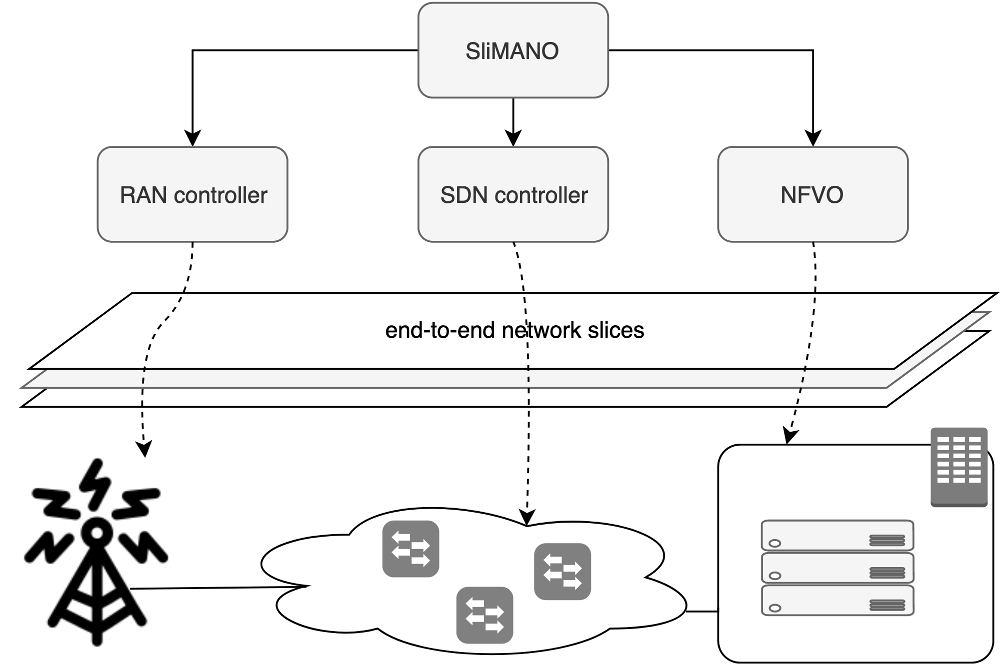
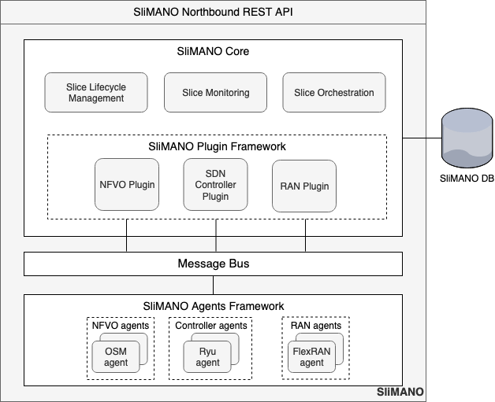

## SliMANO

SliMANO (Slice Management and Orchestration) framework is a plug-in based system that requests network resources and coordinates the interaction among network orchestration entities for its instantiation and chaining in order to perform an end-to-end slice. These entities could range but are not limited to management and orchestration (MANO), Software Defined Networking (SDN) controllers and Radio Access Network (RAN) controllers.

 
**Fig. 1. SliMANO's motivational scenario (from publication [1])**

SliMANO follows a microservices architecture and is divided in three main building blocks, namely the SliMANO Core, SliMANO Plug-in Framework and SliMANO Agents Framework.

  
**Fig. 2. SliMANO framework (from publication [1])**

### Publications

1. F. Meneses​, M. Fernandes, D. Corujo, R. L. Aguiar, “SliMANO: An Expandable Framework for the Management and Orchestration of End-to-end Network Slices”, ​IEEE International Conference on Cloud Networking (IEEE CloudNet 2019), ​Coimbra, Portugal, Nov 2019

### Members

- [Flavio Meneses](https://www.it.pt/Members/Index/18857) (Developer)
- Manuel Fernandes (Developer)
- [Daniel Corujo](https://www.it.pt/Members/Index/1953) (Project Manager)
- [Rui Aguair](https://www.it.pt/Members/Index/357) (Team Leader)

### Support or Contact

Check out our [documentation](https://github.com/ATNoG/SliMANO/wiki) or contact a project member for support and we’ll help you sort it out.
